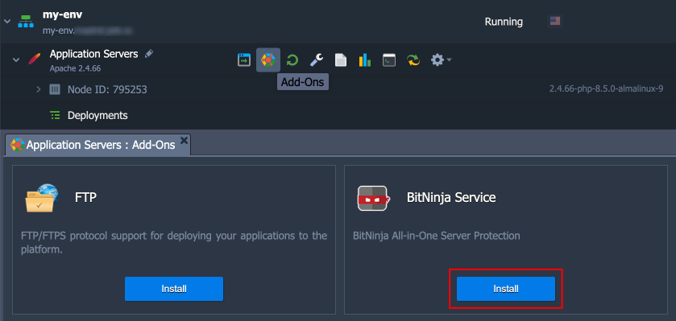
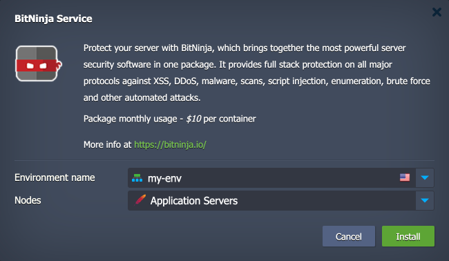
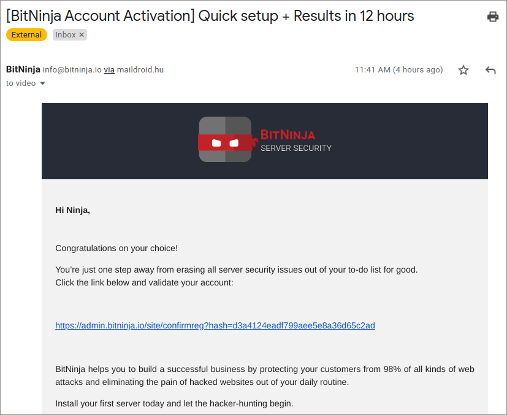
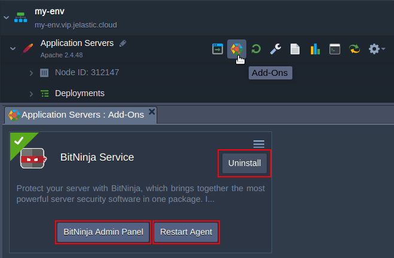

 

# BitNinja Add-On

**[BitNinja](https://bitninja.io/)** is an easy-to-use, maintenance-free server security tool. It acts as an agent that resides in your infrastructure and sends information about an attack to a central cloud server.

The servers protected by BitNinja collect and exchange information about attacks with each other, accumulating a knowledge base. If the attack occurs on a server protected by BitNinja and the IP address is blocked, it will be blocked on all servers protected by BitNinja worldwide. This BitNinja technology is called a Defense Network.

In Virtuozzo Application Platform (VAP), this software is installed by a specially designed add-on.

> **Note:** Currently, BitNinja does not fully support modern *nftables-based* systems, which is the default for Virtuozzo Application Platform AlmaLinux-based containers. Therefore, some BitNinja functionalities that rely on *iptables* (e.g., WAF and captcha modules) may not work as expected. BitNinja team is working on the issue, and full support is expected to be implemented in future releases.

## Add-On Installation

To install the BitNinja add-on for your VAP containers, you must be registered on one of the [Virtuozzo Public Cloud Providers](https://www.virtuozzo.com/application-platform-partners/).

1\. Log in to your Virtuozzo Application Platform dashboard. Then hover over the required container and click the **Add-Ons** icon.

> Alternatively, you can deploy this solution from the [Marketplace](https://www.virtuozzo.com/application-platform-docs/marketplace/) or [import](https://www.virtuozzo.com/application-platform-docs/environment-import/) a manifest file from this repository.

2\. In the opened installation window, specify the target environment and nodes layer (automatically selected if installed from the container's *Add-Ons* section).

Click **Install** to proceed and wait for a minute while the solution is deployed. Add-on installs the BitNinja agent and creates an account on the BitNinja cloud service, which must be confirmed and activated.

3\. When the installation is finished, you will get an email with the following subject: "***\[BitNinja Account Activation\] Quick setup + Results in 12 hours***".

Follow the BitNinja account activation link and set up the password. That's it, your server is under protection.

4\. Finally, you can log in to the BitNinja service console and monitor the events.

## Manage Add-On

Using the add-on UI, you can either get to the **Admin Panel**, **Restart Agent**, or **Uninstall** the add-on.

 
The service usage costs $10 per month for every server.

For additional information on the package usage within the Virtuozzo Application Platform, please refer to the [BitNinja Server Security Add-On](https://www.virtuozzo.com/application-platform-docs/bitninja-server-security/) article.
