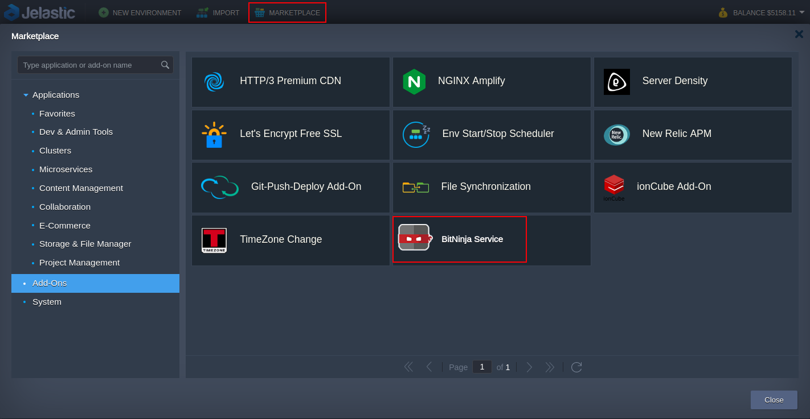
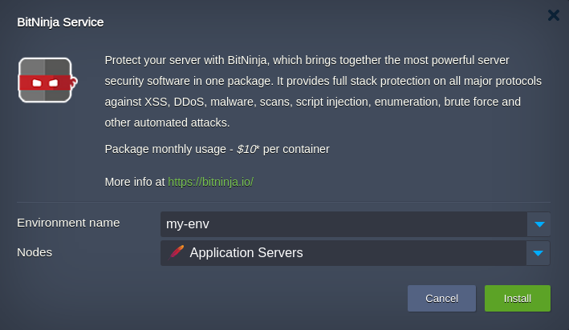
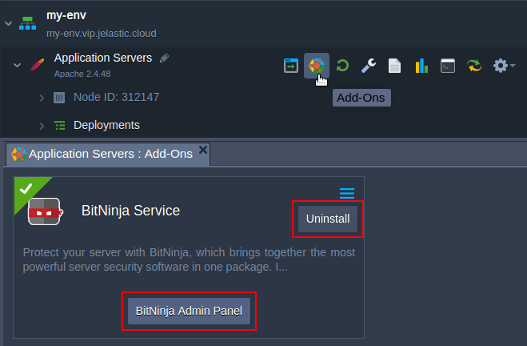

# BitNinja Add-On

BitNinja is an easy-to-use, maintenance-free server security tool. It acts as an agent that resides in your infrastructure and sends information about an attack to a central cloud server.

The servers protected by BitNinja collect and exchange information about attacks with each other, accumulating a knowledge base. If the attack occurs on a server protected by BitNinja and the IP is blocked, it will be blocked on all servers protected by BitNinja around the world. This BitNinja technology is called a Deffense Network.

In Jelastic this software is installed by specially designed add-on.

## Installation Process
1. Import the [raw link of the add-on manifest](https://raw.githubusercontent.com/jelastic-jps/bitninja/main/manifest.jps) within Jelastic PaaS dashboard or initiate the installation within **Marketplace > Add-Ons**.

> **Note:** To access the dashboard you need to be registered at one of the [Jelastic Public Cloud providers](https://jelastic.cloud).

 

2. In the opened window, choose the environment where BitNinja should be installed, the preferred nodes layer and press **Install**. 

 

Add-on installs BitNinja agent, creates an account at BitNinja cloud service that must be confirmed and activated.

3. When the installation is finished, you will get an email with a subject: “***\[BitNinja Account Activation\] Quick setup + Results in 12 hours***”. It contains an activation link.

 

Follow the link and set up the password for your account. That's it, your server is under protection.

4. Finally, you can log in the BitNinja service Console and monitor the events.

 

## Addon's Options

Using add-on UI you can either get to the admin console or uninstall the add-on.

 
The service usage costs $10 per month for every server. 
